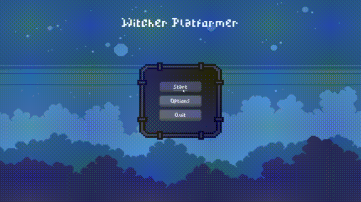
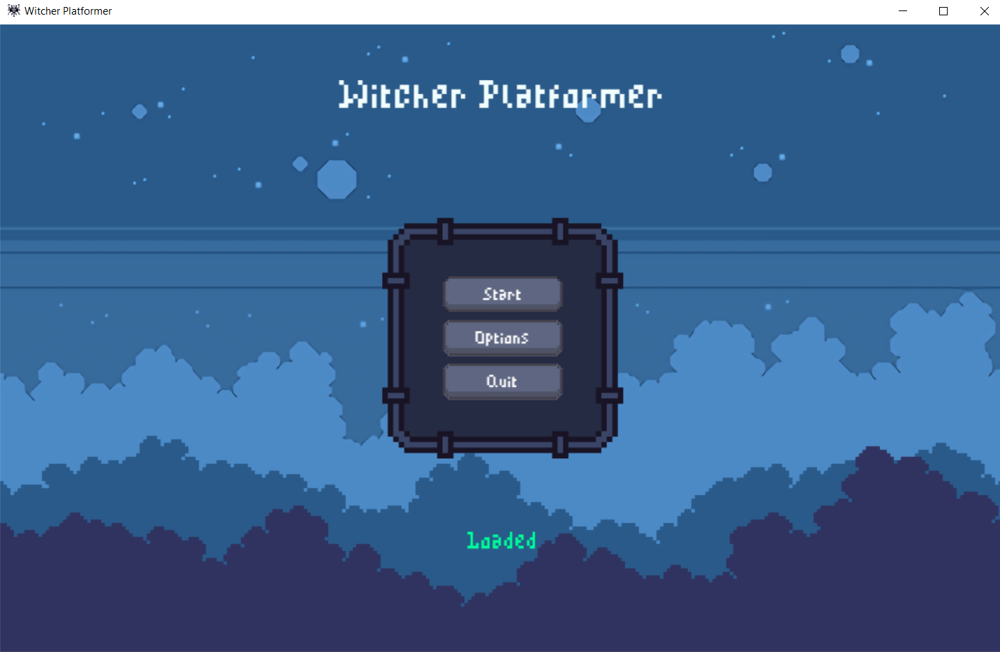
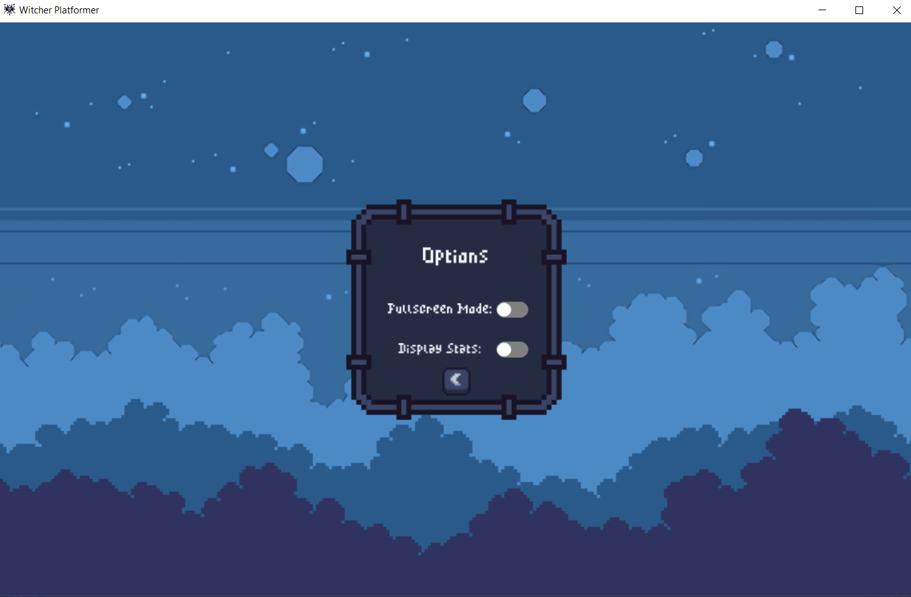
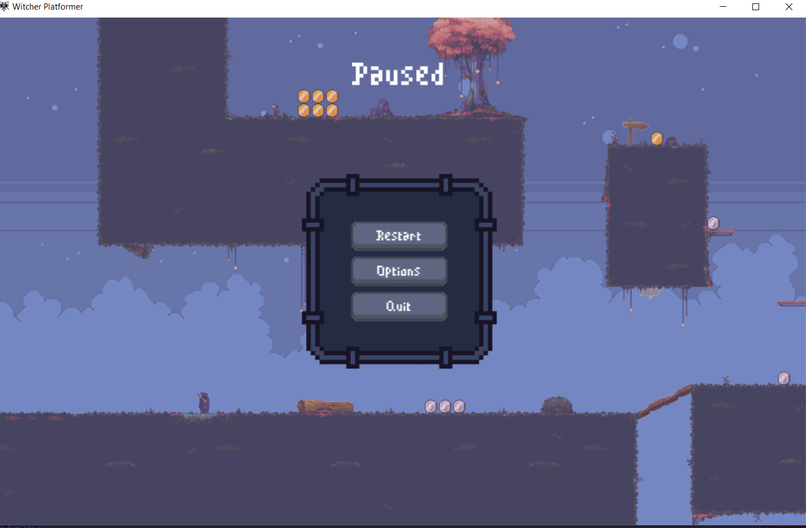

#  Witcher Platformer Game
*A one level platformer game*

## Gameplay
Witcher Platformer by Hariss-Gills</a></iframe>
As a hooded witcher 🐺, you traverse through the grim world collecting coins and try to get the best time and score.

**Score is calculated by 1/Time + Points**
* Red coin = 10 points
* Gold coin = 5 points
* Silver coin = 1 point
### Controls

- W/⬆️/SPACE to Jump
- A/⬅️ to move left
- D/➡️ to move right
- S/⬇️ to move down

### Game Play
>*The gif doesn't do the graphics justice*





### Installation

You can Package the program using pyinsatller

1. First [Download latest version of python][python-url]

2. install pyinstaller with:
```pip install pyinstaller```

3. Enter the directory where the `game.py` file is and run this command:
Not: Highscore Does not save and Loads Slower but more user-friendly
```
pyinstaller game.py --windowed --add-data "game_assets;game_assets" --name "Witcher Platformer" --icon  "game_assets\icon.ico" --onefile

``` 

or this command where Highscore saves and Loads Faster but less user-friendly:

```
pyinstaller game.py --windowed --add-data "game_assets;game_assets" --name "Witcher Platformer" --icon  "game_assets\icon.ico"

```

4. Go into the `Dist` directory and run the `Witcher PLatformer` application


### Functions

* Full GUI
* Options Menu
* Pause Screen

## Future Plans

* Enemies (Difficult)
* Animated Coins (Easy)
* More Levels (Medium)

## Release History

* 0.0.1
    * Main Game Complete

## Meta

Distributed under the GPL-3.0 License. See [``LICENSE.txt``](/LICENSE.txt) for more information.

[https://github.com/Hariss-Gills/](https://github.com/Hariss-Gills/)

## Contributing

1. Fork it (<https://github.com/Hariss-Gills/Witcher-Platformer>)
2. Create your feature branch (`git checkout -b feature/fooBar`)
3. Commit your changes (`git commit -am 'Add some fooBar'`)
4. Push to the branch (`git push origin feature/fooBar`)
5. Create a new Pull Request

<!-- Markdown link & img dfn's -->
[python-url]: https://www.python.org/downloads/ 
[npm-url]: https://npmjs.org/package/datadog-metrics
[npm-downloads]: https://img.shields.io/npm/dm/datadog-metrics.svg?style=flat-square
[travis-image]: https://img.shields.io/travis/dbader/node-datadog-metrics/master.svg?style=flat-square
[travis-url]: https://travis-ci.org/dbader/node-datadog-metrics
[wiki]: https://github.com/yourname/yourproject/wiki